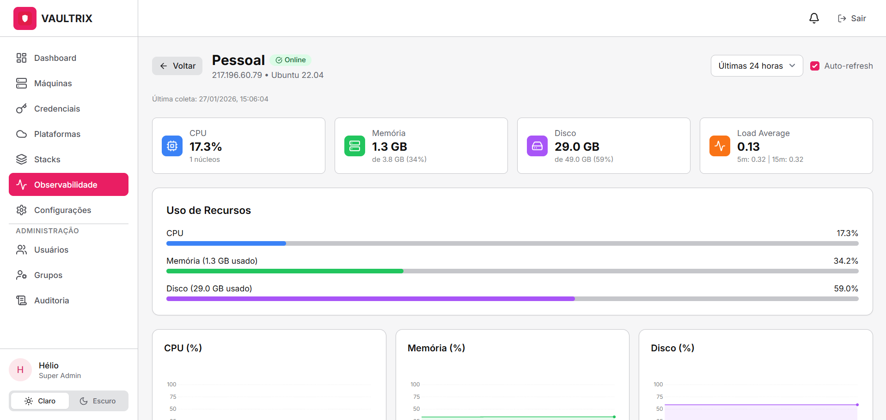
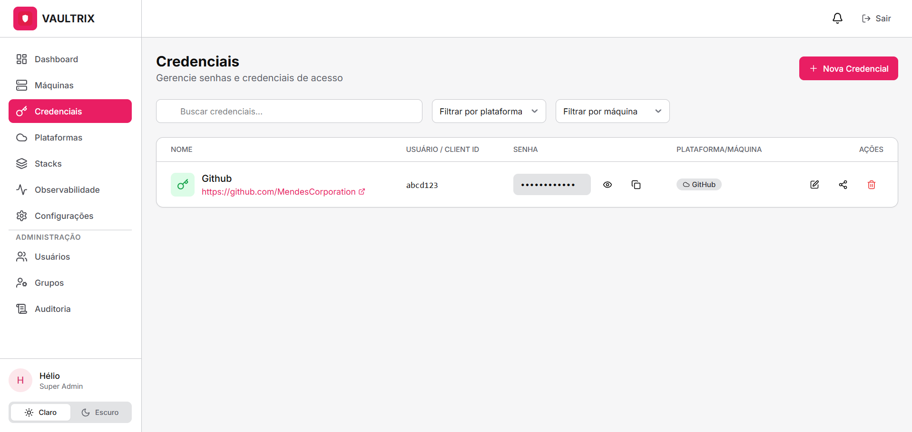
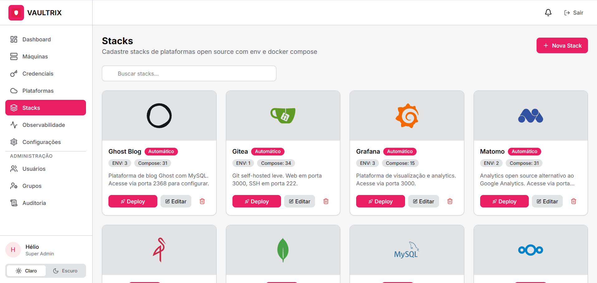
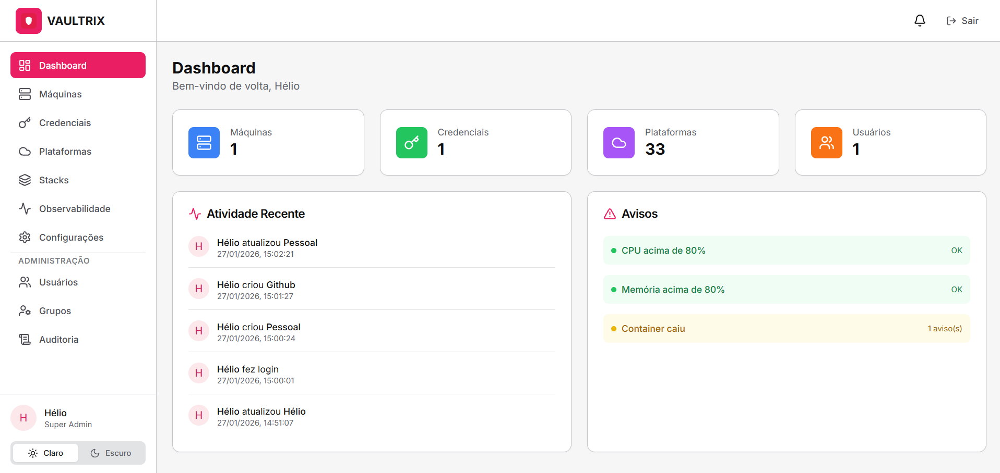
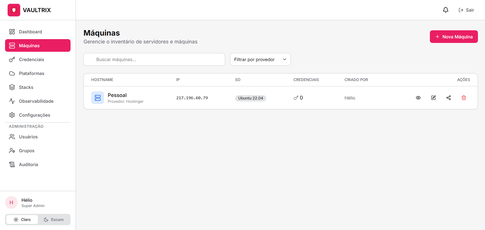
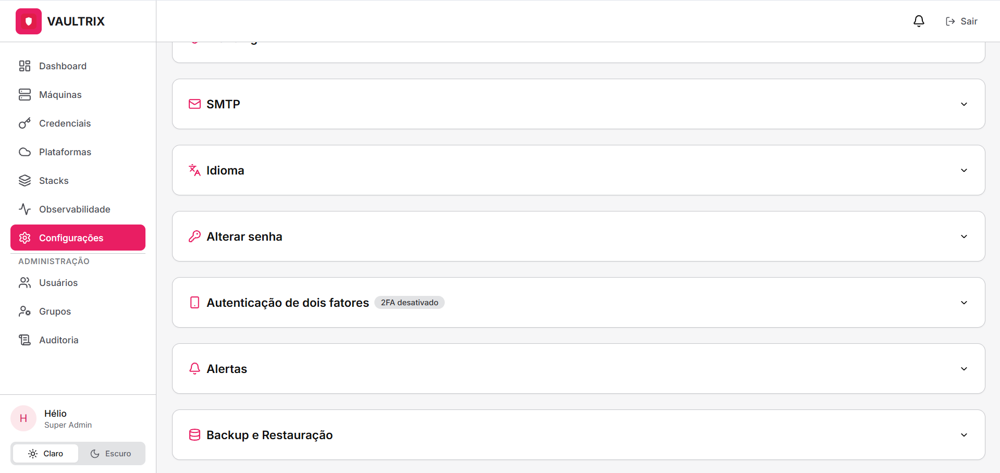

<div align="center">
  
  
  # Vaultrix
  
  **Secure Infrastructure & Credential Management Platform**
  
  [](https://hub.docker.com/r/helio5/vaultrix)
  [](https://opensource.org/licenses/MIT)
  [](https://nextjs.org/)
  [](https://www.postgresql.org/)
  
  A comprehensive platform for managing infrastructure, credentials, monitoring, and automated deployments with enterprise-grade security.
  
  [Features](#features) • [Quick Start](#quick-start) • [Documentation](#documentation) • [Screenshots](#screenshots) • [Contributing](#contributing)
</div>

---

## 🌟 Features

### 🔐 Security First
- **End-to-End Encryption**: AES-256-GCM encryption for all sensitive data
- **Multi-Factor Authentication (MFA)**: TOTP-based 2FA support
- **Role-Based Access Control (RBAC)**: Granular permissions system
- **Audit Logging**: Complete audit trail of all system activities
- **Secure Password Storage**: Argon2id hashing with configurable parameters

### 🖥️ Infrastructure Management
- **Machine Inventory**: Centralized server and VM management
- **SSH Integration**: Secure remote access with key-based authentication
- **Provider Support**: Multi-cloud provider integration (AWS, Azure, GCP, DigitalOcean, Hetzner, and more)
- **Real-time Monitoring**: System metrics and container status tracking
- **Automated Agent Deployment**: One-click agent installation via SSH

### 📊 Observability & Monitoring
- **System Metrics**: CPU, Memory, Disk, and Load Average monitoring
- **Container Monitoring**: Docker container status and resource usage
- **Custom Alerts**: Configurable thresholds for CPU, memory, and container health
- **Machine Offline Detection**: Automatic offline machine detection
- **Real-time Dashboard**: Live metrics visualization

<div align="center">
  
  <p><em>Real-time monitoring dashboard with system metrics and container status</em></p>
</div>

### 🔑 Credential Management
- **Secure Vault**: Encrypted storage for passwords, API tokens, and secrets
- **Multiple Credential Types**: Support for login/password, API tokens, and OAuth client secrets
- **Platform Integration**: Pre-configured templates for 40+ platforms
- **Quick Copy**: One-click secure copy to clipboard

<div align="center">
  
  <p><em>Secure credential vault with platform integration</em></p>
</div>

### 🚀 Stack Deployment
- **One-Click Deployments**: Pre-configured Docker Compose stacks
- **18+ Ready-to-Deploy Stacks**: WordPress, Nginx Proxy Manager, n8n, Ghost, Nextcloud, Plausible, Portainer, Uptime Kuma, Minio, Grafana, Prometheus, and more
- **Custom Stacks**: Create and deploy your own Docker Compose configurations
- **Deployment Logs**: Real-time deployment progress tracking
- **SSH-Based Deployment**: Secure remote deployment via SSH

<div align="center">
  
  <p><em>One-click deployment of pre-configured application stacks</em></p>
</div>

### 💾 Backup & Recovery
- **Automated Backups**: Scheduled PostgreSQL database backups
- **Flexible Scheduling**: Daily or custom day-of-week schedules
- **Retention Policies**: Configurable backup retention periods
- **One-Click Restore**: Easy database restoration from backups
- **Backup History**: Complete backup audit trail

### 👥 User & Team Management
- **Multi-User Support**: Unlimited users with role-based access
- **User Roles**: Super Admin, Admin, and User roles
- **Group Management**: Organize users into groups with shared permissions
- **Invitation System**: Secure user invitation workflow
- **Session Management**: Active session tracking and control

### 🌍 Internationalization
- **Multi-Language Support**: English and Portuguese (BR)
- **User Preferences**: Per-user language selection
- **Extensible**: Easy to add new languages

### 🎨 Modern UI/UX
- **Dark/Light Mode**: Automatic theme switching
- **Responsive Design**: Mobile-friendly interface
- **Real-time Updates**: Live data refresh without page reload
- **Intuitive Navigation**: Clean and organized interface

<div align="center">
  
  <p><em>Clean and intuitive dashboard with quick access to all features</em></p>
</div>

---

## 🚀 Quick Start

### Prerequisites

- Docker and Docker Compose
- 2GB RAM minimum (4GB recommended)
- 10GB disk space

### Production Deployment (Recommended)

1. **Download the docker-compose file**:
   ```bash
   curl -O https://raw.githubusercontent.com/MendesCorporation/vaultrix/main/docker-compose.yml
   curl -O https://raw.githubusercontent.com/MendesCorporation/vaultrix/main/.env.example
   ```

2. **Create your environment file**:
   ```bash
   cp .env.example .env
   ```

3. **Configure environment variables**:
   ```bash
   nano .env
   ```
   
   Required variables:
   ```env
   # Database
   DB_USER=vaultrix
   DB_PASSWORD=your_secure_password_here
   DB_NAME=vaultrix
   
   # Security (generate with: openssl rand -base64 32)
   AUTH_SECRET=your_auth_secret_here
   
   # Encryption (generate with: openssl rand -hex 32)
   ENCRYPTION_PEPPER=your_encryption_pepper_here
   
   # Application
   NEXT_PUBLIC_APP_NAME=Vaultrix
   AUTH_URL=http://localhost:3000
   ```

4. **Start the application**:
   ```bash
   docker-compose up -d
   ```

5. **Access Vaultrix**:
   - Open your browser and navigate to `http://localhost:3000`
   - Complete the initial setup wizard
   - Create your admin account

### Development Setup

1. **Clone the repository**:
   ```bash
   git clone https://github.com/MendesCorporation/vaultrix.git
   cd vaultrix
   ```

2. **Install dependencies**:
   ```bash
   npm install
   ```

3. **Set up environment**:
   ```bash
   cp .env.example .env
   # Edit .env with your configuration
   ```

4. **Start PostgreSQL** (using Docker):
   ```bash
   docker run -d \
     --name vaultrix-db \
     -e POSTGRES_USER=vaultrix \
     -e POSTGRES_PASSWORD=vaultrix \
     -e POSTGRES_DB=vaultrix \
     -p 5432:5432 \
     postgres:16-alpine
   ```

5. **Run database migrations**:
   ```bash
   npx prisma migrate dev
   ```

6. **Seed the database** (optional):
   ```bash
   node scripts/seed.js
   ```

7. **Start development server**:
   ```bash
   npm run dev
   ```

8. **Access the application**:
   - Open `http://localhost:3000`

### Using Docker Compose for Development

```bash
# Start with local build
docker-compose -f docker-compose-dev.yml up -d

# View logs
docker-compose -f docker-compose-dev.yml logs -f

# Rebuild after code changes
docker-compose -f docker-compose-dev.yml up -d --build
```

---

## 📖 Documentation

### Architecture

Vaultrix is built with modern technologies:

- **Frontend**: Next.js 15 (App Router), React 19, TailwindCSS
- **Backend**: Next.js API Routes, Prisma ORM
- **Database**: PostgreSQL 16
- **Authentication**: NextAuth.js with custom providers
- **Encryption**: Node.js Crypto (AES-256-GCM, Argon2id)
- **Monitoring Agent**: Go-based lightweight agent
- **Deployment**: Docker, Docker Compose

### Security Architecture

1. **Data Encryption**:
   - User passwords: Argon2id hashing
   - Sensitive data: AES-256-GCM encryption
   - Per-user Data Encryption Keys (DEK)
   - Master key derivation from user password

2. **Access Control**:
   - Role-based permissions (RBAC)
   - Resource-level permissions
   - Group-based access control
   - Session management with token rotation

3. **Audit Trail**:
   - All actions logged with user, IP, and timestamp
   - Immutable audit log
   - Export capabilities for compliance

### Monitoring Agent

The Vaultrix agent is a lightweight Go binary that collects system metrics:

- **Metrics Collected**: CPU usage, memory, disk, load average, Docker containers
- **Installation**: Automated via SSH or manual one-liner
- **Communication**: HTTPS with token authentication
- **Scheduling**: Configurable interval (default: 1 minute)
- **Footprint**: <10MB RAM, minimal CPU usage

**Manual Installation**:
```bash
curl -sSL https://your-vaultrix-url/agent/vaultrix-agent-linux-amd64 -o /tmp/vaultrix-agent
chmod +x /tmp/vaultrix-agent
sudo /tmp/vaultrix-agent --install \
  --token=YOUR_TOKEN \
  --api-url=https://your-vaultrix-url/api/telemetry \
  --interval=1
```

### API Documentation

Vaultrix provides a RESTful API for all operations:

- **Authentication**: Session-based with JWT tokens
- **Rate Limiting**: Configurable per-endpoint limits
- **Versioning**: API version in URL path
- **Documentation**: OpenAPI/Swagger (coming soon)

### Environment Variables

| Variable | Description | Required | Default |
|----------|-------------|----------|---------|
| `DATABASE_URL` | PostgreSQL connection string | Yes | - |
| `AUTH_SECRET` | NextAuth.js secret key | Yes | - |
| `AUTH_URL` | Application base URL | Yes | - |
| `ENCRYPTION_PEPPER` | Additional encryption salt | Yes | - |
| `NODE_ENV` | Environment mode | No | `production` |
| `APP_PORT` | Application port | No | `3000` |
| `STORAGE_PATH` | File storage path | No | `/app/storage` |
| `BACKUP_PATH` | Backup storage path | No | `/app/backups` |
| `TZ` | Timezone | No | `America/Sao_Paulo` |

---

## 📸 Screenshots

<div align="center">
  
### Machine Management

<p><em>Comprehensive machine inventory with SSH integration</em></p>

### System Configuration

<p><em>Flexible system configuration and customization options</em></p>

</div>

---

## 🔧 Configuration

### SMTP Configuration

Configure email notifications in the system settings:

1. Navigate to **Settings** → **SMTP Configuration**
2. Enter your SMTP server details
3. Test the connection
4. Enable email notifications

### Backup Configuration

Set up automated backups:

1. Navigate to **Settings** → **Backup**
2. Configure backup schedule (daily or specific days)
3. Set retention period
4. Choose backup destination (local or remote)

### Alert Configuration

Create custom monitoring alerts:

1. Navigate to **Observability** → **Alerts**
2. Select a machine
3. Configure thresholds:
   - CPU usage percentage
   - Memory usage percentage
   - Container down detection
   - Machine offline detection

---

## 🐳 Docker Hub

Official Docker images are available at:

**Repository**: [`helio5/vaultrix`](https://hub.docker.com/r/helio5/vaultrix)

**Available Tags**:
- `latest` - Latest stable release
- `0.0.1` - Specific version

**Pull the image**:
```bash
docker pull helio5/vaultrix:latest
```

---

## 🛠️ Development

### Project Structure

```
vaultrix/
├── agent/                 # Go monitoring agent
├── prisma/               # Database schema and migrations
├── public/               # Static assets
├── scripts/              # Utility scripts
├── src/
│   ├── app/             # Next.js app directory
│   │   ├── (auth)/      # Authentication pages
│   │   ├── (dashboard)/ # Dashboard pages
│   │   └── api/         # API routes
│   ├── components/      # React components
│   └── lib/             # Utility libraries
├── docker-compose.yml        # Production compose
├── docker-compose-dev.yml    # Development compose
└── Dockerfile           # Application container
```

### Running Tests

```bash
# Run all tests
npm test

# Run with coverage
npm run test:coverage

# Run specific test file
npm test -- path/to/test.spec.ts
```

### Building for Production

```bash
# Build Next.js application
npm run build

# Build Docker image
docker build -t vaultrix:local .

# Build and tag for Docker Hub
docker build -t helio5/vaultrix:0.0.1 -t helio5/vaultrix:latest .
```

### Database Migrations

```bash
# Create a new migration
npx prisma migrate dev --name migration_name

# Apply migrations
npx prisma migrate deploy

# Reset database (development only)
npx prisma migrate reset
```

---

## 🤝 Contributing

Contributions are welcome! Please follow these steps:

1. Fork the repository
2. Create a feature branch (`git checkout -b feature/amazing-feature`)
3. Commit your changes (`git commit -m 'Add amazing feature'`)
4. Push to the branch (`git push origin feature/amazing-feature`)
5. Open a Pull Request

### Development Guidelines

- Follow the existing code style
- Write meaningful commit messages
- Add tests for new features
- Update documentation as needed
- Ensure all tests pass before submitting PR

---

## 📝 License

This project is licensed under the MIT License - see the [LICENSE](LICENSE) file for details.

---

## 🙏 Acknowledgments

- Built with [Next.js](https://nextjs.org/)
- Database powered by [PostgreSQL](https://www.postgresql.org/)
- ORM by [Prisma](https://www.prisma.io/)
- Authentication by [NextAuth.js](https://next-auth.js.org/)
- Icons by [Lucide](https://lucide.dev/)
- Monitoring agent written in [Go](https://golang.org/)

---

## 📞 Support

- **Issues**: [GitHub Issues](https://github.com/MendesCorporation/vaultrix/issues)
- **Discussions**: [GitHub Discussions](https://github.com/MendesCorporation/vaultrix/discussions)
- **Email**: contato@apptrix.app

---

<div align="center">
  Made with ❤️ by the Apptrix Team
  
  ⭐ Star us on GitHub — it motivates us a lot!
</div>
